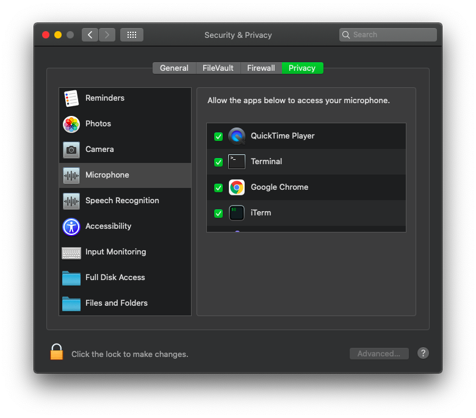

## Setup

macOS needs to grant permission for the audio input to be accessed by the app.

This can be done by running a program which uses the mic. A simple solution has been outlined below.

1. Install [SoX](http://sox.sourceforge.net/) on your mac with `brew install sox`
2. Run `sox -d -d` in your terminal (Let's you hear your mic input).
3. Click `ok` on the popup to grant your terminal emulator access to the microphone.

Your terminal emulator(s) should now be visible in `System Preferences > Security & Privacy > Privacy > Microphone`.



## Installation

Game can be installed from `examples/bevy_2048` in the [rune repository](https://github.com/hotg-ai/rune).

## Build

Run the build command from the games root directory.

```console
$ cargo run --release
```
